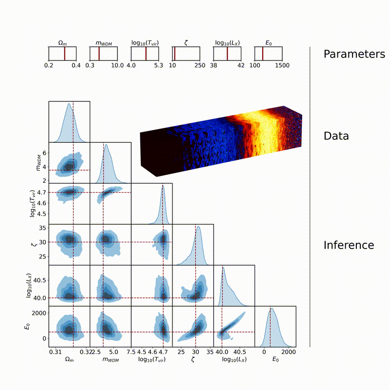

<h2 align="center">Optimal, fast, and robust inference of reionization-era cosmology with the 21cmPIE-INN</h2>

<p align="center">
<a href="https://arxiv.org/abs/2401.04174"></a>


21cm_pie is a machine learning based tool for fast simulations-based inference from simulated 3D 21cm light cone data.  It contains modules to simulate and infer the posterior for 6d parameter set. 

## Animation



## Installation

```sh
# clone the repository
git clone https://github.com/cosmostatistics/21cmPie
# then install in dev mode
cd 21cmPie
pip install --editable .
```

## Usage

Simulating data with [21cmFAST][21cmFAST] and adding noise with [21cmSense][21cmSense] :

[21cmFAST]: https://github.com/21cmfast/21cmFAST
[21cmSense]: https://github.com/jpober/21cmSense

```
21cm_pie data params/data.yaml
```
Training the model, typically done in three stages, first the 3D CNN, then the INN and finally both:
```
21cm_pie train params/train.yaml
```
Analysing the performance and creating inference plots
```
21cm_pie plot params/plot.yaml
```